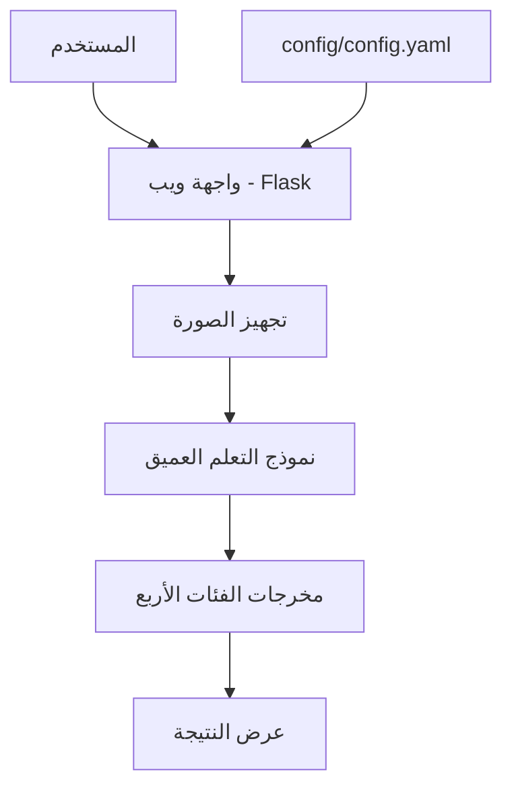

<div align="center">

# 🩺 Kidney Disease Classification

### نظام تصنيف صور الكلى باستخدام التعلم العميق

<!-- ACADEMIC-INFO-START -->
<p><strong>إعداد/المهندس:</strong> [حميدحسين محمد العذيب]</p>
<p><strong>الكلية:</strong> [كلية المجتمع_صنعاء]</p>
<p><strong> التخص:</strong> [Ai]</p>
<p><strong>إشراف:</strong> [د/عبدالله يحيى محمد معاذ]</p>
<!-- ACADEMIC-INFO-END -->

تطبيق ويب عربي لتصنيف صور الكلى إلى أربع فئات، مع إعدادات منظمة وتقارير تدريب وتقييم.


[نظرة عامة](#-نظرة-عامة) ·
[النتائج](#-نتائج-التقييم) ·
[التشغيل](#-التثبيت-والتشغيل) ·
[هيكل المشروع](#-هيكل-المشروع) ·
[التقرير التفصيلي](docs/PROJECT_REPORT.md)

</div>

---

## 📌 نظرة عامة

يهدف المشروع إلى تصنيف صور الكلى إلى إحدى الفئات الأربع التالية:

| الفئة البرمجية | الوصف |
|---|---|
| **Cyst** | كيس |
| **Normal** | طبيعي |
| **Stone** | حصى |
| **Tumor** | ورم |

يتضمن المشروع نموذجًا أساسيًا، وتجربة ضبط دقيق (Fine-tuning)، ووحدة تنبؤ، وواجهة ويب تستخدم Flask لرفع الصور وعرض نتائج النموذج.

> **تنبيه طبي:** المشروع مخصص للتطوير والتجربة التقنية، وليس أداة تشخيص طبي معتمدة. لا تستخدم نتائجه وحدها لاتخاذ قرار تشخيصي أو علاجي.

## 🧩 كيف يعمل النظام؟



## 📊 نتائج التدريب والتقييم

الأرقام التالية مأخوذة من تقارير المشروع الحالية.

### مقارنة ملخصات التجارب

| المؤشر | النموذج الأساسي | الضبط الدقيق |
|---|---:|---:|
| عدد العصور المطلوبة | 25 | 15 |
| العصور المكتملة | 16 من 25 | 12 من 15 |
| أفضل عصر | 11 | 7 |
| أفضل دقة تحقق مسجلة | **90.72%** | **100.00%** |
| خسارة التحقق | 0.300771 | 0.00019242 |

### نتائج تقرير التحقق

| المقياس | القيمة المسجلة |
|---|---:|
| Validation Accuracy | **90.72%** |
| Macro F1-Score | **89.26%** |
| Weighted F1-Score | **90.78%** |

### الأداء حسب الفئة

| الفئة | Precision | Recall | F1-Score |
|---|---:|---:|---:|
| **Cyst** | 91.95% | 97.56% | 94.67% |
| **Normal** | 94.32% | 88.53% | 91.33% |
| **Stone** | 75.21% | 89.22% | 81.61% |
| **Tumor** | 92.50% | 86.55% | 89.43% |

### تفسير النتائج

يسجل ملخص الضبط الدقيق دقة تحقق قدرها 100.00%، بينما يسجل تقرير التدقيق 90.72%. لا ينبغي اعتبار النتيجتين نتيجة واحدة قبل التأكد من أن التقريرين أُنشئا باستخدام ملف الأوزان نفسه.

## 🖥️ واجهة التطبيق

توفر الواجهة:

- رفع صورة من جهاز المستخدم.
- تمرير الصورة إلى وحدة التنبؤ.
- عرض الفئة التي توقعها النموذج.
- عرض درجات الفئات الأربع.

عنوان التشغيل المحلي:

`http://127.0.0.1:5000`

## 💻 التثبيت والتشغيل

### 1. إنشاء بيئة Python مستقلة على Windows

افتح PowerShell داخل مجلد المشروع:

```powershell
py -3.8 -m venv .venv
.\.venv\Scripts\Activate.ps1
python -m pip install -r requirements.txt
```

### 2. تجهيز أوزان النموذج

ملفات الأوزان بصيغة `.h5` غير مرفوعة إلى Git عمدًا. يجب توفير الملفات المطلوبة داخل مجلد `models/` من خلال حزمة التسليم المصرح بها.

الأوزان المستخدمة في حزمة التسليم المحلية:

- `models/best_candidate_model.h5`
- `models/best_finetuned_model.h5`

استنساخ المستودع وحده لا يوفر ملفات الأوزان هذه.

### 3. تشغيل الواجهة

```powershell
python main.py web
```

افتح المتصفح على:

`http://127.0.0.1:5000`

### 4. أوامر المشروع الأخرى

عرض أوامر التشغيل:

```powershell
python main.py --help
```

تدريب النموذج الأساسي:

```powershell
python main.py train-baseline
```

الضبط الدقيق:

```powershell
python main.py fine-tune
```

تقييم مجموعة التحقق:

```powershell
python main.py evaluate-validation
```

تشغيل الواجهة لا يتطلب إعادة التدريب.

## 📚 المكتبات وإصداراتها

قائمة المتطلبات الحالية مأخوذة من [`requirements.txt`](requirements.txt).

| المكتبة | الإصدار أو التثبيت |
|---|---|
| `tensorflow` | `2.10.1` |
| `keras` | `2.10.0` |
| `numpy` | `1.24.4` |
| `pandas` | `2.0.3` |
| `scikit-learn` | `1.3.2` |
| `scipy` | `1.10.1` |
| `matplotlib` | `3.7.5` |
| `pillow` | `10.4.0` |
| `pyyaml` | `6.0.2` |
| `flask` | `3.0.3` |
| `flask-cors` | `5.0.0` |
| `python-box` | `6.0.2` |
| `ensure` | `1.0.2` |
| `joblib` | `1.4.2` |
| `setuptools` | `75.1.0` |
| `Werkzeug` | `3.0.6` |

تم التحقق من بيئة التطوير باستخدام Python `3.8.20` وTensorFlow `2.10.1` وKeras `2.10.0`. قد تختلف قابلية التثبيت على جهاز آخر بحسب نظام التشغيل وإصدار Python وتوفر الحزم.

## 📁 هيكل المشروع

```text
Kidney-Disease-Classification-MLOps-V2/
├── app.py
├── main.py
├── config/
│   └── config.yaml
├── params.yaml
├── requirements.txt
├── setup.py
├── templates/
│   └── index.html
├── static/
│   └── style.css
├── src/
│   ├── cnnClassifier/
│   │   ├── components/
│   │   ├── config/
│   │   ├── entity/
│   │   └── pipeline/
│   ├── data/
│   ├── evaluation/
│   ├── inference/
│   └── models/
├── models/
├── reports/
│   └── metrics/
├── notebooks/
├── research/
├── dvc.yaml
├── dvc.lock
├── Dockerfile
└── .github/workflows/
```

## 📈 تقارير المشروع

توجد التقارير بصيغة JSON داخل `reports/metrics/`:

- `training_summary.json` — ملخص التدريب الأساسي.
- `fine_tune_summary.json` — ملخص الضبط الدقيق.
- `validation_error_audit.json` — مقاييس التحقق وتقرير التصنيف.

التقرير التفصيلي متاح في [`docs/PROJECT_REPORT.md`](docs/PROJECT_REPORT.md).

## 🔐 حماية البيانات

- صور البيانات المحلية غير مضمنة في Git.
- أوزان النماذج غير مضمنة في Git.
- ينبغي نقل البيانات والأوزان عبر وسيلة آمنة ومصرح بها.
- لا تنشر صور المرضى أو بيانات تعريفية دون تصريح مناسب.

## 🧪 الاختبارات البرمجية

نجحت اختبارات القبول المحلية التالية:

- فحص صياغة 41 ملف Python.
- التحقق من إعدادات الفئات الأربع والملفات الأساسية.
- تنفيذ `main.py --help`.
- فتح الصفحة الرئيسية عبر Flask.
- رفع صورة من مجموعة التحقق والحصول على استجابة ناجحة.
- ظهور أسماء الفئات الأربع في صفحة النتيجة.
- التحقق من استبعاد صور البيانات والأوزان من ملفات Git المسجلة.

تؤكد هذه الاختبارات نجاح المسار البرمجي الذي تم اختباره فقط، ولا تثبت صلاحية النموذج للتشخيص الطبي.

---

<div align="center">

**التوثيق — المنهجية — النتائج — التشغيل — القيود**

</div>
